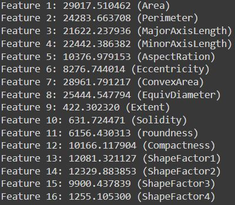
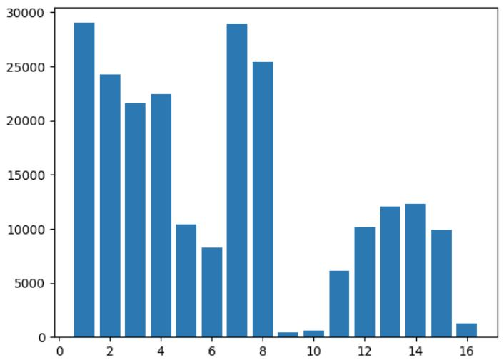

# Dry Bean Classification
A simple classification example using 4 machine learning algorithms and neutral networks.

## Dataset Info
For the task, a dry bean dataset was acquired from the UCI Machine Learning Repository. It contains 13611 samples, with a total of 16 features; 12 dimensions and 4 shape forms, for 7 different dry beans (Seker, Barbunya, Bombay, Cali, Dermosan, Horoz and Sira). More info about the dataset can be found [here](https://archive-beta.ics.uci.edu/dataset/602/dry+bean+dataset).

# Notebook Walkthrough
## **1. Data and its visualization**
After fetching the data directly from the website, unzipping it, a dataframe was created. A historgam was then plotted, containing the counts of the 7 different bean classes, to show the degree of the class imbalance involved. 

Next, a series of 16 graphs were plotted for the 16 features. Each graph compared the density of the bean classes against the feature being explored.

## **2. Preprocessing**
### Feature Selection
Out of the 16 features, 10 of the most relevant ones were to be selected for input to the model. This was done by evaluation of Anova F-scores for each feature (shown below), using the [SelectKBest](https://scikit-learn.org/stable/modules/generated/sklearn.feature_selection.SelectKBest.html#sklearn.feature_selection.SelectKBest) and [f_classif](https://scikit-learn.org/stable/modules/generated/sklearn.feature_selection.f_classif.html#sklearn.feature_selection.f_classif) functions in sklearn. A new dataframe was then made using these final features. 

  
&nbsp; &nbsp; &nbsp; &nbsp;
  

---
### Label Transformation
Class labels of the 7 beans were encoded into integers (0-6). 
 
 ---
### Splitting and Scaling
The dataframe was split into training and testing datasets, 70:30 respectively. The labels of the test set were decoded back into the original bean labels for easy comparison with model output later onwards. Finally, [StandardScaler](https://scikit-learn.org/stable/modules/generated/sklearn.preprocessing.StandardScaler.html) was applied to the input data of the train and test sets for eliminating any dominance between features.

## **3. Models**
The following 4 models/estimators were trained:

- Random Forest Classifier (100 tree estimators)
- k-Nearest Neighbours (k=3)
- Naive Bayes (default setting)
- Support Vector Machines (default setting) 

For testing, a classification report was obtained for each of the estimators. Naive Bayes gave the lowest accuracy of 88%, while the rest 3 achieved an accuracy of about 91%.

## **4. Neural Networks (NN)**
As neural networks have a lot of hyper-parameters to be decided upon before training the model, a grid search was carried out to find the best possible selections/combinations for a few of them.

---
### Setup
In order to apply NN models, the dataset was divided into three portions: train, validation and test sets, ratio being 80:10:10 respectively. The validation set was used to evaluate the loss of each of the different models while training. Bean labels were coverted into one-hot encoded variables for optimized results. Lastly, as before, scaling was applied to the input data of all sets.

---
### Model Design
The neural network consisted of an input layer of 10 nodes (# of input features), followed by 2 dense layers with 'ReLU' activation function. Number of nodes for these layers were to be chosen from grid search. The final output layer contained 7 nodes, corresponding to the bean classes and a 'softmax' activation function. The Adam optimizer was selected. For computing loss and metrics of the model, 'categorical cross-entropy' and 'categorical accuracy' was assigned when compiling the model. 100 epochs were chosen for training and validating each model.

---
### Grid Search
The following four hyper-parameters were selected for tuning, with the values specified: 

- Number of nodes in layer 1 (16, 32)
- Number of nodes in layer 2 (16, 32)
- Learning rate of optimizer (0.01, 0.005, 0.001)
- Batch Size for model (32, 64, 128)

During grid search, the loss of each model (validation loss after 100 epochs) was stored, along with the selected hyper-parameters. Also, graphs were plotted for the training and validation losses and accuracies. An example is shown below.

---
### Final Predictor Performance
After the grid search was completed, the model with the least loss was tested on the test dataset. The model gave an accuracy of 92%. 